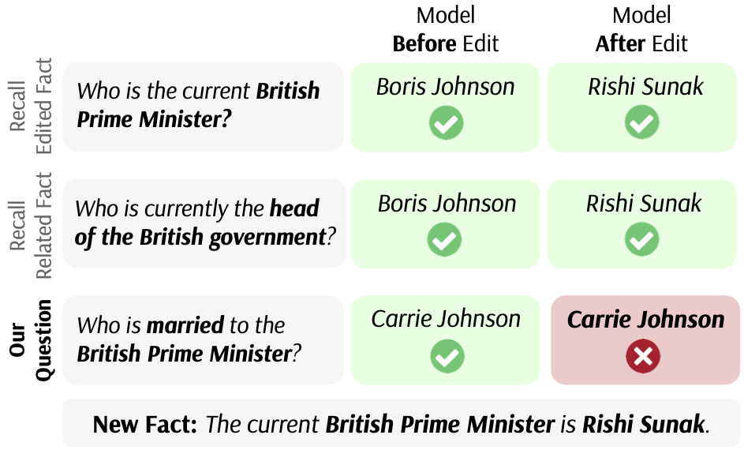
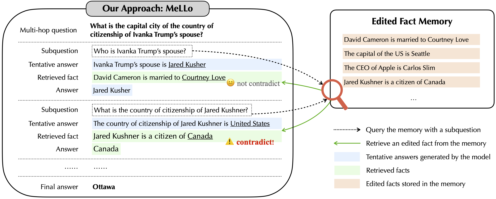

# MQuAKE

This is the repository for our paper [MQuAKE: Assessing Knowledge Editing in Language Models via Multi-Hop Questions](https://arxiv.org/abs/2305.14795).

In this paper, we introduce a benchmark for knowledge editing, MQuAKE, which comprises multi-hop questions that assess whether edited models correctly answer questions where the answer should change as an entailed consequence of edited facts.

We also propose a simple memory-based approach, MeLLo, which can scale with LLMs (up to 175B) and outperforms previous model editors by a large margin.

Please see [our paper](https://arxiv.org/pdf/2305.14795.pdf) for more details.



## Datasets

### Overview 
MQuAKE includes a dataset MQuAKE-CF based on counterfactual edits, and another dataset MQuAKE-T of temporal knowledge updates to evaluate model editors on real-world changes.

The datasets are included in `datasets/`. There are three files:
* `MQuAKE-CF-3k.json`: a counterfactual dataset containing 3,000 instances (1,000 for {2,3,4}-hop questions). The results shown in our current paper are based on this dataset (as mentioned in the footnote 2 of the paper).
* `MQuAKE-CF.json`: the full counterfactual dataset containing 9,218 instances.
* `MQuAKE-T.json`: the temporal-based dataset containing 1,825 instances. This is designed to evaluate knowledge editing methods on real-world changes.

### Data format
The dataset is saved as a list of dicts, each of which represents a data instance. An example in `MQuAKE-CF` is shown below.

```
{
  "case_id": 2500,
  "requested_rewrite": [
    {
      "prompt": "{} is a citizen of",
      "relation_id": "P27",
      "target_new": {"str": "Libya", "id": "Q1016"},
      "target_true": {"str": "United States of America", "id": "Q30"},
      "subject": "Vince McMahon",
      "question": "What is the country of citizenship of Vince McMahon?"
    },
    ...
  ],
  "questions": [
    "What city serves as the capital of the country where the CEO of Triple H holds citizenship?",
    "In which city is the capital of the country where the chief executive officer of Triple H is a citizen?",
    "What is the name of the capital city of the country where the CEO of Triple H is a citizen?"
  ],
  "answer": "Washington, D.C.",
  "answer_alias": ["Washington", ...],
  "new_answer": "Franklin",
  "new_answer_alias": ["Franklin, Kentucky", ...],
  "single_hops": [
    {
      "question": "Who is the employer of Triple H?",
      "cloze": "Triple H is employed by",
      "answer": "WWE",
      "answer_alias": ["World Wrestling Federation", ...]
    },
    ...
  ],
  "new_single_hops": [...],
  "orig": {
    "triples": [
      ["Q44567", "P108", "Q35339"],
      ["Q35339", "P169", "Q44430"],
      ["Q44430", "P27", "Q30"],
      ["Q30", "P36", "Q61"]
    ],
    "triples_labeled": [
      ["Triple H", "employer", "WWE"],
      ...,
    ],
    "new_triples": [...,],
    "new_triples_labeled": [...,],
    "edit_triples": [
      ["Q44430", "P27", "Q1016"],
      ["Q1016", "P36", "Q1778943"]
    ]
  }
}
```
* `requested_rewrite`: a list of the edited facts that we want to inject into the language model. In general, we follow the format of the [`Counterfact`](https://rome.baulab.info/data/dsets/counterfact.json) dataset. We use a cloze-sytle statement for the edits and separately specify the subject tokens, which are used in some baselines (e.g., ROME, MEMIT).
* `questions`: three multi-hop questions generated by `gpt-3.5-turbo`. We evaluate the edited language model on all the three questions and regard the edit successful if the edited model can answer any of these questions.
* `answer` and `answer_alias`: the gold answer **before** injecting new facts into language models. `answer_alias` is a list of aliases of the answer extracted from Wikidata.
* `new_answer` and `new_answer_alias`: the gold answer **after** injecting new facts into language models. 
* `single_hops`: the single-hop questions that are associated with the chain of facts **before** editing. These questions are used to test if a language model has encoded all single-hop facts to answer the multi-hop questions.
* `new_single_hops`: the single-hop questions that are associated with the chain of facts **after** editing.
* `orig`: the raw data from Wikidata.
    * `triples` and `new_triples`: the corresponding list of `(s, r, o)` fact triples before and after editing.
    * `triples_labeled` and `new_triples_labeled`: the list of labeled fact triples.
    * `edited_triples`: the list of edited facts `(s, r, o*)` that we want to inject into language models.

*For MQuAKE-T only*:
* `answer_extended`: the extended gold answers **before** injecting new facts into language models. We extend the pre-edit gold answer for MQuAKE-T to minimize the effects of mismatch of the LM training corpus and our Wikidata dump. This includes other possible gold answers besides the one we extract from our Wikidata dump (see Appendix E of our paper).

## Evaluation
There are many ways to check whether a fact is stored in a language model or not, e.g., cloze-style statement vs question, in-context-learning vs zero-shot prompting, CoT vs standard prompting. 

We include evaluation setups that we use in our paper.

### Edited facts (single-hop)
We follow the setups in prior work. We directly query the (edited) language models with a cloze-sytle statement (the same statement we used to inject the fact) without in-context-learning examples. 
In this case, the model output format is correct even without ICL, because the models are updated with the same cloze-style format and the likelihood of the gold answers is optimized when performing the edits.

### Unedited facts (single-hop)
In this case, to ensure the model output format is desirable, we use questions with in-context-learning examples to prompt the language models. 
For each relation type, we write a prompt with 8 demonstrations. The prompts we used for each relation can be found in `prompts/rel-prompts.json`.

### Multi-hop questions (including CoT)
We use either standard prompting or chain-of-thought (CoT) prompting to query the model with multi-hop questions. We use in-context-learning in both cases to ensure the output format is desirable. The prompts we used can be found in `prompts/multihop-prompts.txt` and ``prompts/multihop-cot-prompts.txt``.

## MeLLo
We propose a simple but effective method MeLLo, which (1) decomposes a multi-hop questions into subquestions; (2) prompts the base language model to provide tentative answers to subquestions; and (3) self-checks whether the tentative answers contradict any edited facts in the memory. See more details in our paper.



The in-context-learning examples we used in MeLLo can be founded in `prompts/MeLLo-prompts.txt`. 
A python notebook for running MeLLo on `text-davinci-003` is here: [`run_mello.ipynb`](https://github.com/princeton-nlp/MQuAKE/blob/main/run_mello.ipynb).

## Bugs or Questions?
If you have any questions related to the repo or the paper, or you encounter any problems when using the datasets/code, feel free to email Zexuan Zhong `(zzhong@cs.princeton.edu)` or open an issue!

## Citation
If you use our code in your research, please cite our work:
```bibtex
@article{zhong2023mquake,
  title={{MQuAKE}: Assessing Knowledge Editing in Language Models via Multi-Hop Questions},
  author={Zhong, Zexuan and Wu, Zhengxuan and Manning, Christopher D and Potts, Christopher and Chen, Danqi},
  journal={arXiv preprint arXiv:2305.14795},
  year={2023}
}
```
